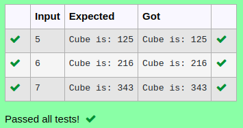

# Ex.No:2(A)  STATIC METHOD

## AIM:
To create a java program for calculate cube of a number using static method.

## ALGORITHM :
1.  Start : Begin the process of calculating the cube of a number.
2.	Declare a variable to store input : Declare an integer variable n to hold the number whose cube will be calculated.
3.	Create a Scanner object : Create a Scanner object (sc) to read the input from the user.
4.	Read input from the user : Prompt the user to input an integer value. The input value is stored in the variable n.
5.	Call the cubecal function : Call the function cubecal(n) which computes the cube of the number by performing n * n * n.
6.	Store the result : Store the result of the cubecal function in an integer variable result.
7.	Output the result :
8.	Print the cube of the number using System.out.println("Cube is: " + result);.
9.	End the program.


## PROGRAM:
 ```
Program to implement a Static method using Java
Developed by    : Sam Israel D 
RegisterNumber  : 212222230128
```

## Sourcecode.java:

```java
import java.util.*;  
public class CalculateCube  
{  
    static void cube()  
    {  
        Scanner sc = new Scanner(System.in);
        int x= sc.nextInt();  
        int y=x*x*x;
        System.out.println("Cube is: "+y);    
    }  
    public static void main(String args[])  
    {  
        cube();    
    }  
}  
```


## OUTPUT:



## RESULT:
Thus the java program for calculate cube of a number using static method has been executed successfully.

